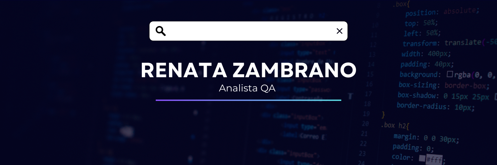

  

<h3 align="center">👋 ¡Qué gusto tenerte aquí!</h3>

 

  

  

---

### 👩‍💻 Sobre Mí  

**Analista QA con experiencia en:**  
✔️ 1+ año en testing funcional y diseño de casos de prueba  
✔️ Diseño de casos de prueba basados en requerimientos  
✔️ Gestión de defectos (Jira, Xray, Zephyr, etc)  

🚀 Actualmente amplío mis conocimientos hacia la automatización de pruebas, explorando herramientas como Selenium WebDriver, JMeter y Cucumber. Mi objetivo es complementar mis habilidades con técnicas más eficientes, siempre manteniendo esa mirada crítica que caracteriza a un buen QA.

> *"Apasionada por la calidad del software como puente entre tecnología y negocio. Actualmente enfocada en escalar mis habilidades técnicas para implementar estrategias de testing más eficientes."*  

---

### 🧰 Skills

---

  

