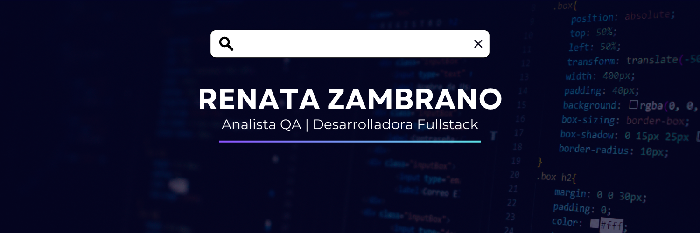

#    
 *Hola 👋 ¡Que gusto tenerte aqui!* 

&nbsp; 

&nbsp;

 

 &nbsp;

 

- *Apasionada por la tecnologia, el aprendizaje continuo y la calidad de software. Mi trayectoria profesional comenzo como Nutricionista, sin embargo, actualmente estoy ampliando mis concimentos en diversas tecnologias dentro del desarrollo de software siempre en constante crecimiento estoy muy feliz de compartir contigo mis proyectos y aprendizaje.*

### Skills

	
    
    	

